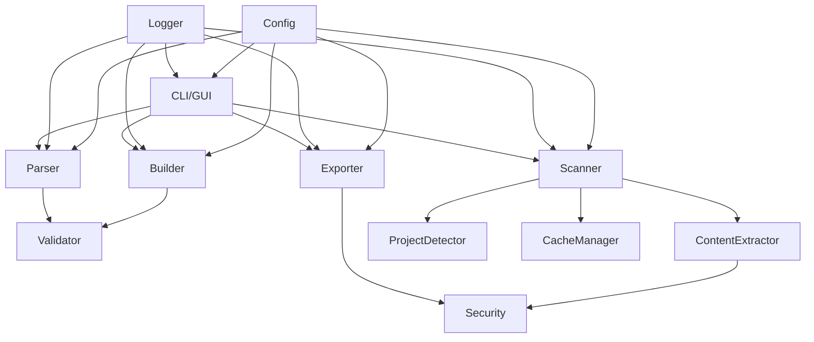

# مشخصات فایل‌های پروژه StructureMaster 📂

این فایل شامل توضیحات کامل در مورد هر فایل پروژه، عملکرد آن و دلیل وجود آن است.

---

## 📁 ساختار کلی پروژه

```
structure-creator-optus/
├── src/                    # کد منبع اصلی
│   ├── modules/           # ماژول‌های هسته
│   ├── cli/               # رابط خط فرمان
│   └── gui/               # رابط گرافیکی
├── docs/                   # مستندات
├── tests/                  # تست‌ها
├── profiles/              # پروفایل‌های تنظیمات
├── plugins/               # افزونه‌ها
├── templates/             # قالب‌ها
└── ...
```

---

## 📄 فایل‌های ریشه

### `requirements.txt`
**هدف:** لیست تمام وابستگی‌های پایتون پروژه

**محتوا شامل:**
- PyQt6: رابط گرافیکی
- Click, Rich: رابط خط فرمان
- cryptography: رمزنگاری AES-256
- PyGithub: یکپارچه‌سازی با گیت‌هاب
- chardet: تشخیص کدگذاری
- و سایر وابستگی‌ها

---

### `setup.py`
**هدف:** فایل نصب و پیکربندی بسته پایتون

**عملکردها:**
- تعریف متادیتای پروژه (نام، نسخه، نویسنده)
- تعریف entry points برای CLI و GUI
- مدیریت وابستگی‌ها
- پیکربندی classifiers برای PyPI

---

### `.gitignore`
**هدف:** تعریف فایل‌هایی که نباید در Git ردیابی شوند

**الگوها شامل:**
- فایل‌های کش پایتون (`__pycache__/`, `*.pyc`)
- محیط مجازی (`venv/`, `.env`)
- فایل‌های IDE
- لاگ‌ها و خروجی‌های ساخت

---

### `.structureignore`
**هدف:** تعریف الگوهای نادیده‌گیری برای StructureMaster

**مشابه `.gitignore` اما برای اسکن پروژه‌ها:**
- `node_modules/`
- `vendor/`
- `__pycache__/`
- `.git/`
- فایل‌های باینری و کامپایل‌شده

---

### `README.md`
**هدف:** معرفی پروژه و راهنمای شروع سریع

**محتوا:**
- معرفی ویژگی‌ها
- دستورالعمل نصب
- مثال‌های استفاده
- لینک‌های مستندات

---

## 📁 پوشه `src/` - کد منبع

### `src/__init__.py`
**هدف:** مقداردهی اولیه بسته و تعریف متادیتا

**محتوا:**
```python
__version__ = '1.0.0'
__author__ = 'StructureMaster Team'
```

---

### `src/config.py`
**هدف:** مرکز تنظیمات و ثابت‌های برنامه

**کلاس‌ها و Enum‌ها:**
| نام | توضیح |
|-----|--------|
| `LogLevel` | سطوح لاگ (TRACE, DEBUG, INFO, WARN, ERROR, CRITICAL) |
| `ProjectType` | انواع پروژه (LARAVEL, REACT, VUE, DJANGO, ...) |
| `ExportFormat` | فرمت‌های خروجی (JSON, TXT, MARKDOWN, ...) |
| `Theme` | تم‌های رابط کاربری (DARK, LIGHT, SYSTEM) |
| `AppPaths` | مسیرهای پیش‌فرض برنامه |
| `Config` | کلاس اصلی تنظیمات |

**ثابت‌های مهم:**
- `BINARY_EXTENSIONS`: پسوندهای فایل‌های باینری
- `TEXT_EXTENSIONS`: پسوندهای فایل‌های متنی
- `DEFAULT_IGNORE_PATTERNS`: الگوهای نادیده‌گیری پیش‌فرض
- `PROJECT_MARKERS`: نشانگرهای تشخیص نوع پروژه

---

### `src/utils.py`
**هدف:** توابع کمکی عمومی

**دسته‌بندی توابع:**
| دسته | توابع |
|------|--------|
| فایل سیستم | `get_file_size()`, `get_file_hash()`, `is_binary_file()` |
| مسیر | `normalize_path()`, `get_relative_path()`, `sanitize_filename()` |
| الگو | `match_pattern()`, `match_any_pattern()` |
| JSON/YAML | `load_json()`, `save_json()`, `load_yaml()` |
| درخت | `build_tree_string()`, `parse_tree_structure()` |
| Threading | `parallel_map()` |

---

### `src/main.py`
**هدف:** نقطه ورود اصلی برنامه

**عملکرد:**
- تشخیص حالت اجرا (CLI یا GUI)
- راه‌اندازی رابط مناسب

---

## 📁 پوشه `src/modules/` - ماژول‌های هسته

### `modules/__init__.py`
**هدف:** صادرکردن تمام ماژول‌ها برای دسترسی آسان

---

### `modules/logger.py`
**هدف:** سیستم لاگ‌گیری چندسطحی

**کلاس `Logger`:**
- پشتیبانی از سطوح: TRACE, DEBUG, INFO, WARN, ERROR, CRITICAL
- خروجی رنگی در کنسول
- ذخیره در فایل
- صادرات به TXT, JSON, HTML

**ویژگی‌ها:**
- Singleton pattern
- Thread-safe
- لاگ در حافظه برای دسترسی سریع

---

### `modules/parser.py`
**هدف:** تجزیه ساختار پروژه از فرمت‌های مختلف

**کلاس `StructureParser`:**
| متد | توضیح |
|-----|--------|
| `parse()` | تجزیه خودکار با تشخیص فرمت |
| `parse_json()` | تجزیه JSON |
| `parse_tree()` | تجزیه متن درختی |
| `parse_plain()` | تجزیه مسیرهای ساده |
| `parse_clipboard()` | تجزیه از کلیپ‌بورد |
| `parse_file()` | تجزیه از فایل |

**فرمت‌های پشتیبانی:**
- JSON تودرتو: `{"src": {"main.py": null}}`
- JSON فلت: `["src/main.py", "src/utils.py"]`
- متن درختی: `├── src/`
- مسیرهای ساده: `src/main.py`

---

### `modules/validator.py`
**هدف:** اعتبارسنجی ساختار پروژه

**کلاس `StructureValidator`:**
| بررسی | توضیح |
|-------|--------|
| نام فایل | کاراکترهای معتبر، طول مناسب |
| نام‌های رزرو | COM1, LPT1, NUL, ... |
| طول مسیر | حداکثر 260 کاراکتر (Windows) |
| تداخل | فایل و پوشه با نام یکسان |
| عمق | حداکثر عمق مجاز |
| تکرار | مسیرهای تکراری |

---

### `modules/scanner.py`
**هدف:** اسکن و استخراج ساختار پروژه‌های موجود

**کلاس `ProjectScanner`:**
| ویژگی | توضیح |
|-------|--------|
| Multi-threaded | اسکن موازی برای سرعت |
| Smart caching | کش نتایج برای پروژه‌های بزرگ |
| Auto-detect | تشخیص خودکار نوع پروژه |
| Ignore patterns | پشتیبانی از `.structureignore` |

**کلاس `FileInfo`:**
اطلاعات هر فایل شامل:
- نام، مسیر، اندازه
- تاریخ ایجاد و تغییر
- نوع MIME
- آیا باینری است؟

---

### `modules/content_extractor.py`
**هدف:** استخراج محتوای فایل‌ها با متادیتا

**کلاس `ContentExtractor`:**
| قابلیت | توضیح |
|--------|--------|
| تشخیص کدگذاری | با استفاده از chardet |
| هش SHA-256 | برای تایید یکپارچگی |
| تشخیص باینری | جلوگیری از استخراج نادرست |
| Multi-threaded | استخراج موازی |

**کلاس `FileContent`:**
```python
@dataclass
class FileContent:
    path: str
    filename: str
    size: int
    mime_type: str
    sha256_hash: str
    permissions: str
    created_date: datetime
    modified_date: datetime
    encoding: str
    is_binary: bool
    content: Optional[str]
    line_count: int
```

---

### `modules/builder.py`
**هدف:** ساخت ساختار پروژه

**کلاس `StructureBuilder`:**
| متد | توضیح |
|-----|--------|
| `build()` | ساخت ساختار |
| حالت force | بازنویسی موجودها |
| حالت dry-run | پیش‌نمایش بدون ایجاد |
| Rollback | برگشت در صورت خطا |

---

### `modules/exporter.py`
**هدف:** صادرات به فرمت‌های مختلف

**کلاس `Exporter`:**
| فرمت | متد |
|------|------|
| JSON | `_to_json()` |
| TXT | `_to_tree()` |
| Markdown | `_to_markdown_structure()` |
| YAML | `_to_yaml()` |
| HTML | `_to_html_structure()` |
| ZIP | `_create_zip()` |
| TAR.GZ | `_create_targz()` |

---

### `modules/security.py`
**هدف:** امنیت و رمزنگاری

**کلاس `SecurityManager`:**
| قابلیت | توضیح |
|--------|--------|
| `encrypt()` | رمزنگاری AES-256-CBC |
| `decrypt()` | رمزگشایی |
| `scan_for_sensitive_data()` | تشخیص اطلاعات حساس |
| `sanitize_content()` | پاکسازی اطلاعات حساس |
| `generate_checksum()` | ایجاد checksum |

**الگوریتم رمزنگاری:**
- AES-256-CBC
- PBKDF2HMAC با SHA-256
- 100,000 تکرار
- HMAC برای یکپارچگی

---

### `modules/project_detector.py`
**هدف:** تشخیص خودکار نوع پروژه

**کلاس `ProjectDetector`:**
از سیستم امتیازدهی وزن‌دار استفاده می‌کند:
```python
ProjectType.LARAVEL: [
    ('artisan', 100),          # وزن بالا
    ('composer.json', 30),     # وزن متوسط
    ('app/Http/Kernel.php', 80),
]
```

---

### `modules/profile_manager.py`
**هدف:** مدیریت پروفایل‌های تنظیمات

**کلاس `ProfileManager`:**
| متد | توضیح |
|-----|--------|
| `list_profiles()` | لیست پروفایل‌ها |
| `get()` | دریافت پروفایل |
| `save()` | ذخیره پروفایل |
| `create()` | ایجاد جدید |
| `delete()` | حذف |

**پروفایل‌های پیش‌فرض:**
- full: استخراج کامل
- minimal: فقط ساختار
- backup: با رمزنگاری
- security-audit: تشخیص اطلاعات حساس

---

### `modules/diff_compare.py`
**هدف:** مقایسه دو ساختار پروژه

**کلاس `DiffCompare`:**
| خروجی | توضیح |
|-------|--------|
| `to_markdown()` | گزارش Markdown |
| `to_json()` | گزارش JSON |
| `to_html()` | گزارش HTML تعاملی |

**انواع تغییرات:**
- ADDED: اضافه شده
- REMOVED: حذف شده
- MODIFIED: تغییر یافته
- TYPE_CHANGED: تغییر نوع

---

### `modules/cache_manager.py`
**هدف:** مدیریت کش برای بهبود عملکرد

**کلاس `CacheManager`:**
- کش حافظه و دیسک
- TTL-based expiration
- محدودیت اندازه
- آمار hit/miss

---

### `modules/file_analyzer.py`
**هدف:** تحلیل کیفیت کد

**کلاس `FileAnalyzer`:**
| متریک | توضیح |
|--------|--------|
| LOC | خطوط کد |
| Blank lines | خطوط خالی |
| Comments | خطوط توضیحات |
| Complexity | پیچیدگی سیکلوماتیک |
| TODOs/FIXMEs | نشانگرهای "بعداً" |

---

### `modules/plugin_manager.py`
**هدف:** مدیریت افزونه‌ها

**کلاس `PluginBase`:**
پایه برای ایجاد افزونه:
```python
class MyPlugin(PluginBase):
    NAME = 'MyPlugin'
    
    def on_load(self):
        pass
    
    def on_scan_complete(self, result):
        pass
```

---

## 📁 پوشه `src/cli/` - رابط خط فرمان

### `cli/__init__.py`
**هدف:** صادرکردن دستورات CLI

---

### `cli/cli.py`
**هدف:** پیاده‌سازی کامل CLI

**دستورات:**
| دستور | توضیح |
|--------|--------|
| `scan` | اسکن پروژه |
| `build` | ساخت ساختار |
| `extract` | استخراج محتوا |
| `compare` | مقایسه پروژه‌ها |
| `analyze` | تحلیل کد |
| `preview` | پیش‌نمایش |
| `profiles` | مدیریت پروفایل |
| `log` | مشاهده لاگ |

**ویژگی‌ها:**
- خروجی رنگی با Rich
- نوار پیشرفت
- جداول زیبا
- درخت تعاملی

---

## 📁 پوشه `src/gui/` - رابط گرافیکی

### `gui/__init__.py`
**هدف:** صادرکردن کلاس‌های GUI

---

### `gui/styles.py`
**هدف:** تعریف استایل‌ها و تم

**متغیرها:**
- `COLORS`: پالت رنگی
- `MAIN_STYLE`: استایل اصلی PyQt6
- `CARD_STYLE`: استایل کارت‌ها
- `LOG_VIEWER_STYLE`: استایل نمایشگر لاگ

---

### `gui/components.py`
**هدف:** کامپوننت‌های قابل استفاده مجدد

**کلاس‌ها:**
| کلاس | توضیح |
|------|--------|
| `CardWidget` | کارت container |
| `StatCard` | نمایش آمار |
| `TreeViewWidget` | نمایش درختی |
| `LogViewerWidget` | نمایش لاگ |
| `FileInputWidget` | انتخاب فایل/پوشه |
| `ProgressWidget` | نوار پیشرفت |
| `ConfirmDialog` | دیالوگ تایید |

---

### `gui/main_window.py`
**هدف:** پنجره اصلی برنامه

**کلاس `MainWindow`:**
- سایدبار ناوبری
- هدر با عنوان صفحه
- محتوای تبی (Stacked Widget)
- منو و نوار وضعیت

---

### `gui/tabs/`
**هدف:** تب‌های مختلف رابط کاربری

| فایل | توضیح |
|------|--------|
| `structure_builder_tab.py` | ساخت ساختار |
| `structure_extractor_tab.py` | استخراج ساختار |
| `content_extractor_tab.py` | استخراج محتوا |
| `settings_tab.py` | تنظیمات |

---

## 📁 پوشه `docs/` - مستندات

| فایل | توضیح |
|------|--------|
| `TUTORIAL_FA.md` | راهنمای کامل فارسی |
| `FILE_SPECS_FA.md` | مشخصات فایل‌ها (این فایل) |

---

## 🔗 ارتباط بین ماژول‌ها



---

**پایان مستندات مشخصات فایل‌ها**
